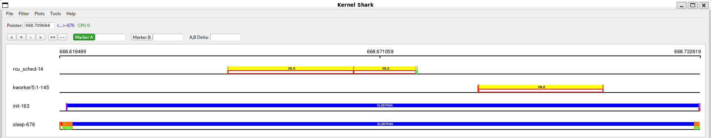
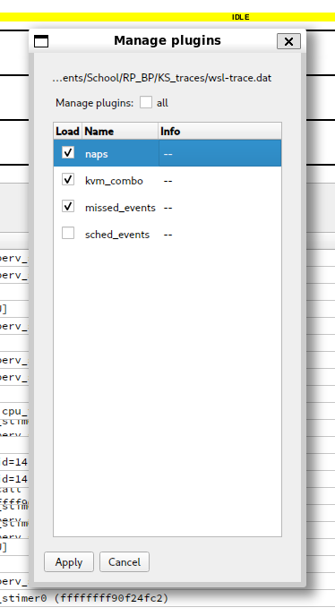
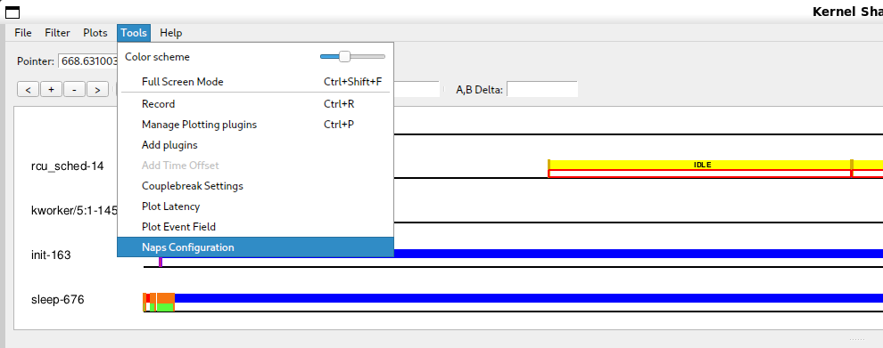
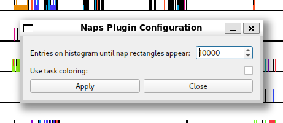
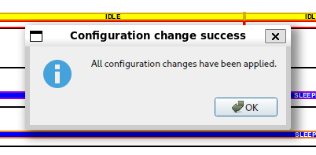

# Intro

This document serves as a simple to grasp manual for the "naps" KernelShark plugin.

Figure 1.

# "How do I build and install this plugin?"

## Prerequisites

- CMake of version at least *3.1.2*
- KernelShark with couplebreak modification and its dependencies
- Doxygen for documentation

## Compatibility

Plugin is compatible with KernelShark's **custom** version *2.4.0-couplebreak* and higher.

With couplebreak on (this necessitates modified KernelShark), the plugin is fully compatible with every default 
KernelShark plugin. With couplebreak off, *sched_events* plugin is incompatible. In general, if any plugin changes 
event's PID data during data stream loading, this plugin will be incompatible with it.

No other dependencies are necessary, except the standard libraries of C and C++ and Doxygen for documentation.

## Build and install only this plugin

1. Set your working directory in terminal as the build directory (best created in the project's root directory (see 
   [README](../../README.md)), if not already present).
2. Run `cmake ..` command (if the main `CMakeLists.txt` file isn't in the parent folder, provide cmake with its
   valid location).
   - If **Doxygen documentation** is desired, include `-D_DOXYGEN_DOC=1` in the command.
   - If **traceevent header files** aren't in `/usr/include`, specify so via `-D_TRACEEVENT_INCLUDE_DIR=[PATH]`, where
    `[PATH]` is replaced by the path to the header files.
   - If **traceevent shared libraries** aren't in `/usr/lib64`, specify so via `-D_TRACEEVENT_LIBS_DIR=[PATH]`, where
    `[PATH]` is replaced by the path to the shared libraries.
   - By default, the **build type** will be `RelWithDebInfo` - to change this, e.g. to `Release`, use the option 
     `-DCMAKE_BUILD_TYPE=Release`.
   - If **Qt6 files** aren't in `/usr/include/qt6`, use the option `-D_QT6_INCLUDE_DIR=[PATH]`, where `[PATH]` is 
     replaced by the path to the Qt6 files.
     - Build instructions still expect that the specified directory has same inner structure as the default case (i.e. 
       it contains `QtCore`, `QtWidgets`, etc.).
   - If **KernelShark source files** aren't in the relative path `../KS_fork/src` from this directory, use
     the option `-D_KS_INCLUDE_DIR=[PATH]`, where `[PATH]` is replaced by the path to KernelShark source files.
   - If **KernelShark's shared libraries** (`.so` files) aren't in `/usr/local/lib64`, use the option
     `-D_KS_SHARED_LIBS_DIR=[PATH]`, where `[PATH]` is replaced by the path to KernelShark shared libraries.
3. Run `make` while still in the `build` directory.
   - If only a part of building is necessary, select a target of your choice.
   - Just running `make` builds: **the plugin** (target `naps`), **symlink** to the plugin SO (target 
     `naps_symlink`) and, if specified, the **Doxygen documentation** (target `docs`).
4. (**Installation**) Plug in the plugin into KernelShark - either via KernelShark's GUI or when starting it via the 
   CLI with the `-p` option and location of the symlink or the SO itself.
   - **IMPORTANT**: Always install/load the plugin before loading a session where said plugin was active! Failure to do
     so will result in KernelShark not completely loading configuration menus or may even crash the whole program.

Use `make clean` to remove built binaries.

## Building KernelShark from source and this plugin with it

1. Ensure all source files (`.c`, `.cpp`, `.h`) of Naps are in the `src/plugins` subdirectory of your KernelShark 
   project directory.
2. Ensure the `CMakeLists.txt` file in said subdirectory contains instructions for building the plugin (copy the style 
   of other Qt-using GUI plugins).
3. Build KernelShark (plugins are built automatically).
4. (**Installation**) Start KernelShark. Plugins built this way will be loaded automatically. If that for some reason 
   failed, look for the SO as for any other default-built KernelShark plugin, again in GUI or via the CLI.

## WARNING - loading plugin twice

If you have two or more versions of the plugin, do **NOT** load them at the same time - doing so **WILL CRASH** the 
program. Use either one or the other, but **NEVER BOTH**.

# "How do I enable/disable naps?"

Enabling the plugin is very simple. All one has to do is open KernelShark and navigate to 
`Tools > Manage Plotting plugins` toolbar menu button. If the plugin was loaded via the command-line interface,
it will be shown in the list of plotting plugins as a checkbox plus the name, checkbox already being ticked.
If not, it is possible to search for the plugin via provded `Tools > Add plugin` button - it's sufficient to
find the symlink, but searching for the actual shared object file is possible too. As you can see, the plugin
follows standard KernelShark plugin loading behaviour.

Figure 2.

Ticked checkbox means the plugin is enabled, empty checkbox means the plugin is disabled.

# "How do I use naps?"

## Configuration

Plugin configuration can be done at any time, even before any trace file is loaded.

Additional button will appear in `Tools` menu with the label `Naps Configuration` (figure 3).
Clicking on it will show a window dialog (figure 4), which will house configuraton options for the plugin. One of the
two configuration options available for this plugin is the maximum amount of entries visible on the graph before the
plugin is allowed to work. This configuration option can help if there are either not enough visible plugin shapes
for a current zoom level or if there are too many and program memory is is too great. By default, the value is set to 
10000 (ten thousand).

Figure 3.

Figure 4.

The second configuration option is toggled via the labeled checkbox visible in (figure 4). The option is whether to
color the nap rectangle's top and bottom outlines the same color as KernelShark uses for the task (figure 5).
Otherwise, the same color as the one used for the filling will be used (figure 6). By default, this option is off.

Figure 5.

Figure 6.

Clicking on `Apply` button will confirm changes made to the configuration and close the window, showing a pop-up 
(figure 7) if the the operation was successful. Clicking on the `Close` button or the X button in the window header
will close the window without applying any changes. Changes made to a window that hasn't applied them to the 
configuration will be lost and upon reopening, the window will again show what's in the currently applied 
configuration.

Figure 7.

In regards to KernelShark's sessions, the configuration is NOT persistent and options included before will have to be
adjusted again upon a new session or trace file load.

## In the graph

Visualised nap has already been shown in figures 3 and 4, this section talks about these visualisations more.

To view naps in a graph of a trace, let KernelShark show you task plots. The plugin will automatically draw
rectangles between switch and waking events, coloring them according to the previous state of the task that will
then switch to another task. Top and bottom outlines of the rectangles are colored using the same color, or, if
turned on in the configuration, using the task's own color. If the rectangle is wide enough, then the full name
of the previous state of the task will be displayed as well (figure 8).

Figure 8.

The rectangles will be visible as long as the zoom level allows two entries belonging to the same nap to also be
visible and as long as there aren't too many entries visible on the graph (this can be adjusted in the configuration).

The rectangles cannot be interacted with in any capacity.

## Using naps as a library

See technical documentation, as this is not intended usage of the plugin and such usage explanations will be omitted.

# Bugs & glitches

No known bugs, but there were plenty of unexpected surprises during plugin testing - if more were discovered,
contact the author via e-mail `djsebofficial@gmail.com`.

# Recommendations

A few recommendations of usage by the author for the smoothest user experience.

Always preload Naps before loading a session. It can save the program from nasty surprises.

If having two versions of the plugin is desired, put them into different build directories.

It is recommended to turn on couplebreak in KernelShark to allow greater compatiblity with other
plugins, especially sched_events.

It is recommended to not set the histogram limit in the configuration too high as to not make the plugin use
too much memory with many nap rectangles being present.

While KernelShark's sessions work, they are a little buggy. This plugin attempts its best to not get in the way of
their inner logic, but a warning should be issued that if the plugin isn't loaded beforehand, there might be
unexpected behaviours, e.g. loading a session when the plugin was active won't add the plugin's menu to the
`Tools` menu.
